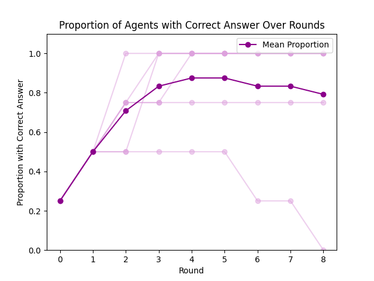
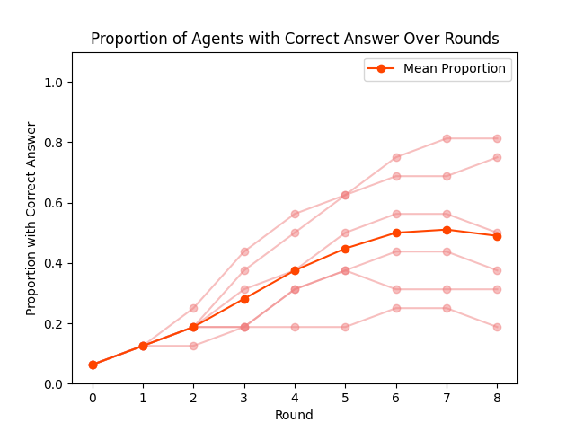
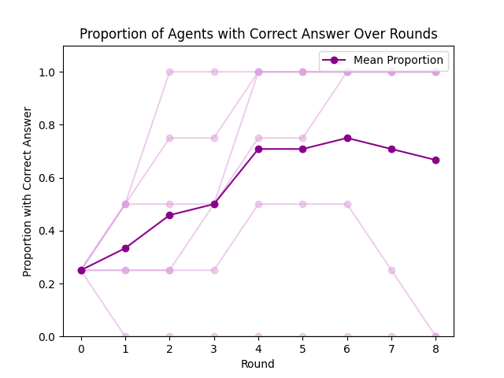
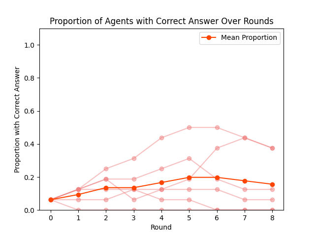

# Mapping the flow of information in LLM groups
## Overview
We present a simple experiment for analyzing the diffusion of information through a group of LLM agents. One agent starts with private information about the correct answer, while the rest guess at random. Agents interact in pairs over multiple rounds to share information and potentially update guesses based on information received from others. 

In the ideal case, through pairwise interactions without replacement, this correct answer should rapidly spread through the group. The simulation explores whether groups of LLM agents can converge to a unanimous decision on the right answer, and if so how quickly.

## Structure
The project consists of three Python scripts:
* `debate_manager.py` defines the `DebateManager` class, which manages the simulation of a group debate where agents exchange information over multiple rounds, via pairwise interactions.
* `agent.py` defines the `Agent` class, which models an LLM-based agent interacting, deciding whether or not to update based on new information via prompt and API call.
* `main.py` The `main` function specifies adjustable parameters, then runs multiple iterations of the simulation when executed.

### Parameters
Adjustable parameters in the `main` function are:
* `NUM_AGENTS` - Group size. Given the pairwise interactions, this should be an even integer (tested up to N = 16).
* `NUM_ROUNDS` - Number of discussion rounds per simulation (tested with 8 rounds).
* `NUM_SIMULATIONS` -  

## Results

|                     N = 4 Agents                            |                         N = 16 Agents                         |                  |
| ----------------------------------------------------------- | ------------------------------------------------------------- | ---------------- |
|  |    |    Temp = 0.2    |
|  |  |    Temp = 1.2    |

We found that overall performance (measured as proportion with correct answer and time to convergence) decreased with larger group sizes and higher temperatures. Further, we observed the spontaneous emergence of misinformation (agents claiming to hear the wrong answer from a reliable source), which was also associated with higher temperatures. See [project report](https://www.apartresearch.com/project/fishing-for-the-answer-mapping-the-flow-of-information-in-llm-agent-groups-using-lessons-from-fish-schools) for more results and discussion. 

## Requirements
### Dependencies
This project requires Python 3.9+ and packages `dotenv`, `matplotlib`, `numpy`, and `requests`, which can be installed using pip:

```
pip install python-dotenv matplotlib numpy requests
```

### API Keys
This project requires OpenAI API access for the GPT models and can be modified to use other LLMs. The corresponding API keys should be provided as environment variables stored in a '.env' file in the project directory or your home directory. This file, ignored by git for security, is a text file with key=value pairs, e.g.:

```
OPENAI_API_KEY="sk-..."
OPENAI_API_ORG="org-..."
ANTHROPIC_API_KEY="sk-ant-..."
...
```

These variables are imported from the `.env` file using the `dotenv` package:

```python
import dotenv
dotenv.load_dotenv()
```

## Usage
To run, execute the main.py script:

```
python main.py
```

## Credits
This project was developed by Matthew Lutz and Nyasha Duri as part of the [Multi-Agent Security Research Sprint](https://alignmentjam.com/jam/masec) organized by [Apart Research](https://www.apartresearch.com/sprints). See our [Project Report](https://www.apartresearch.com/project/fishing-for-the-answer-mapping-the-flow-of-information-in-llm-agent-groups-using-lessons-from-fish-schools) with preliminary results for more.

